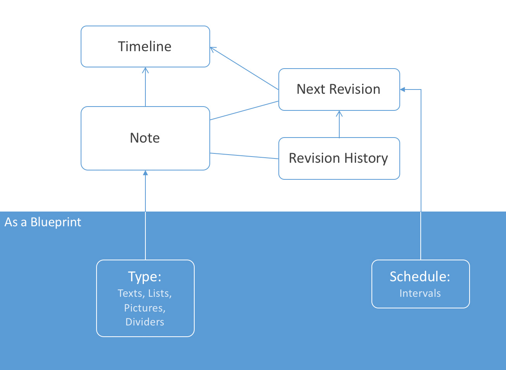
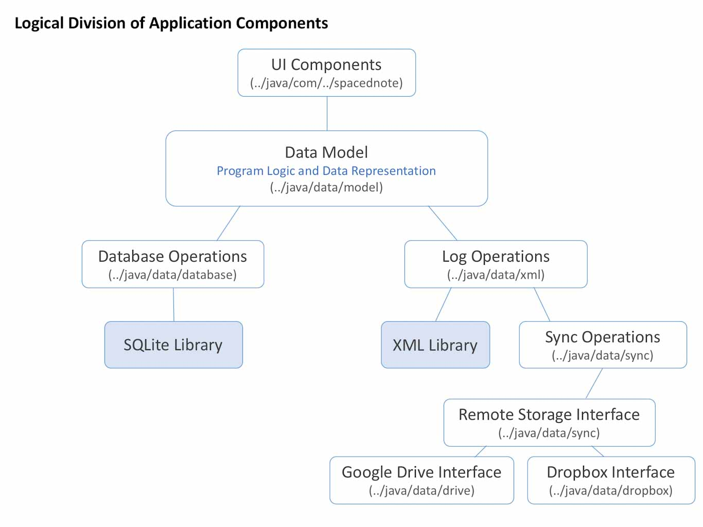

google-site-verification: google9e4edcd6ced170ee.html

# Spaced Notes
An Android application for helping learners in memorizing study materials more efficiently using spaced-repetition techniques

This application provides unique features that sets it aport from common note taking counterparts, including:

<ul>
<li>Creating styles once and using them in multiple notes.</li>
<li>Creating a fully customizable revision pattern for notes, which allaws the implementation of spaced repetition technique</li>
<li>Creating completely seperate profiles for different study materials.</li>
<li>Syncronizing application data on Dropbox or Google Drive</li>
</ul>

# The idea behind Spaced Notes

When studying and learning new concepts, for example, mathematical concepts, it is important to repeat the materials in order to retain the information and recall them at a later time. This is one of the reasons why children learn their first language fast, the words and structures get repeated for them every day. A technique called "spaced repetition" uses this feature of the human mind to facilitate learning. In the spaced repetition technique, after learning a new concept, it gets repeated at first in short intervals and gradually the intervals widen. For instance, a concept can be repeated at days 1, 2, 4, 8, 16, and 32 after learning it for the first times.

Spaced Notes provides the tools for taking notes after studying new materials and offers flexible mechanisms to review the notes based on the schedules defined by the user. The schedule can have any pattern, which allows the implementation of spaced repetition with customizable intervals between study sessions. The way this works is, the application lists the notes that need reviewing in a section called "timeline" and after each review of a note by the user, the application sets the next review date using the schedule that is assigned to that note. The user herself also has the ability to manually change the date for the next review.

# Main elements of Spaced Notes

First, the user creates a template, which is called a "type", for notes indicating what elements notes can have. Next, the user creates one or more schedules, which typically should follow spaced repetition rules. After that, the application is set up and ready for note-taking. That is, whenever the user wants to memorize something using spaced repetition, she creates a note of those materials and assigns a schedule to it. The application will bring the note into the timeline, where is the place the user will revise the notes, whenever appropriate.

**Types:**

Users can define one or more "types". each type is like a blueprint from which notes can be created. Conversely, each note must be made from one and only one type. A Type indicates the kind of elements and the style of each element in the notes that are created from it. Currently, elements supported for types are texts, text lists, photos, and section dividers. A type might consist of any number of any of these elements.

**Notes:**

The materials that users wish to revise are written/inserted in notes. A note itself is made of a number of elements. each element in a note is created using one and only one element from the corresponding type. In other words, the elements of a type, act like blueprints for elements in the notes created from that type. For instance, if a type has two text elements and one photo element, a note made from that type can have any number of elements where each element in the note must be from one of the three elements of that type. A note also supports ordering/arranging of its elements.

**Schedules:**

The user defines one or more "schedules" to specify the way the notes should be revised. Each schedule includes a set of ordered numbers indicating the minimum number of days between revisions. The mechanism of the schedules is best explained by an example. Let us say we have a schedule with numbers 1, 2, 4, 8, 16, and 32 in that order. Once a note is assigned to that schedule, after 1 day of the assignment date, the note will show up for revision. Whenever the user marks the note as revised, the note will show up again after 2 days of that revision date. This means that if the user revises the note after 2 days instead of after 1 day, the note will show up again after 2+2=4 days of the initial assignment to the schedule and not 1+2=3 days. This cycle will repeat for all elements in the sequence of the schedule.

**Timeline:**

Timeline is the main page of the application where the user can see which notes need revision, when and which notes had been revised previously, when and which notes should be revised in the future. Timeline hosts one section for each day, hence three kinds of sections can appear. one section for the current day, sections for past days, and sections for future days. The section for current day presents all the notes that require revision, whether the revision was due days ago or is due the current day; it also shows the revisions finished in the current day. The sections for past days hold the history of previously done revisions and the sections for future days view the notes that should be revised in those days in the future.

**[please click here for details about all elements](docs/elements.md)**

# Application Structure

The logical division of Spaced Notes components can be depicted as below:

**UI Components**

These are components hosting the logic behind user interactions with the application. The components consist of Android UI framework classes such as activities, fragments, list adapters, and custom view classes. These components communicate directly with the [data model](docs/modelcomponents.md). The multi-threading capabilities are also primarily implemented in these components and data model components mostly follow functional programming principles.

[Go to ..java/com/../spacednote](app/src/main/java/com/diplinkblaze/spacednote)

**Data Model**

These components constitute the core functionality as well as the data representation of the application. The following are the main types of classes in this group:

- Object representation of application concepts, such as a note, schedule, type, and etc.
- Object catalogs containing the lists of objects, such as notes, as well as the functions that apply to them.
- Classes containing the logic for scheduling notes and note revision operations.

[For further details about individual components click here](docs/modelcomponents.md)

[Go to ../java/data/model](app/src/main/java/data/model)

**Database Operations**

Each operation that is performed on the SQLite database, is implemented as a method and the methods are encapsulated into classes based on the main entity type they change in the database. As a result, classes are typically created for each entity type in the database. Examples of these classes are NoteOperations, NoteElementOperations, and ScheduleOperations.

[For further details about individual operation classes click here](docs/databaseoperations.md)

[Go to ../java/data/database](app/src/main/java/data/database)

**Log Operations**

Each operation that is performed on the database, is also saved in an XML log file with all the information regarding the operation to reproduce the operation at a later time. Therefore, by having the XML log files, it is possible to regenerate the entire database identically from scratch. It also provides the ability for the application to migrate to another database system without the need to convert the current SQLite database. XML log files are also the reason that the application can sync across devices using free cloud storages such as Google Drive.

[For further details about log operations click here](docs/logoperations.md)

[Go to ../java/data/xml](app/src/main/java/data/xml)

**Sync Operations**

For syncing data between multiple devices, the application shares log files on free cloud storage services and make use of separating log file between devices through the use of a concept called "ports". In order to avoid conflicts between multiple devices modifying the same log files, each device will receive a unique "port" and create its own log files that are associated with that port. Each application instance then executes all the operations in all log files (while only writing to logs associated with one port). All the database operations in the application are defined in such a way that multiple executions of the same operation will not affect the final state of the database. As a result, delays in syncing between multiple devices will not affect the final state of the database in any device; operations from a time "t" will all be executed again if a device has an operation on time t that is not executed yet.

[For further details about sync operations click here](docs/syncoperations.md)

[Go to ../java/data/sync](app/src/main/java/data/sync)

**Remote Storage Interface, Dropbox and Google Drive Interfaces**

To be able to integrate new cloud storage options later, the actual code for connecting to each cloud storage is implemented in a class that implements a common interface called "SyncOperator", which require implementation of methods such as downloading or uploading a file. Each of the individual classes for each cloud storage, in turn, interacts with the corresponding API provided by that cloud storage. The scheme allows the application to implement the logic for syncing log and other files by only seeing a class that is a "SyncOperator" without needing to know what kind of storage it is under the hood.
