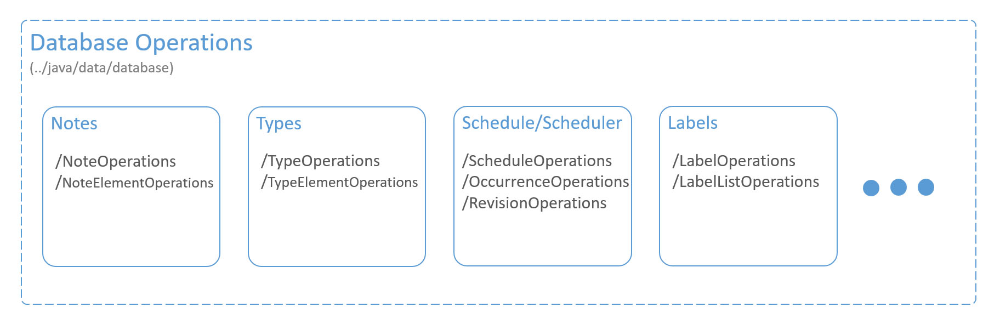

**Application Structure**

The logical division of Spaced Notes components can be depicted as below:

## Database Operations

The changes to the underlying databases are only done through methods that are in database operations classes. These classes contain the logic for the database operations. These methods deliver data using the data representation from data model. The underlying calls to the database and database transactions are hidden from the rest of the codebose (they are contained in database operations classes).

[Go to ../java/data/database](../app/src/main/java/data/database)

**Notes**

The class "NoteOperations" contain methods for adding, editnig, deleting, and quarying notes. The class "NoteElementOperations" contain methods for adding, editing, deleting, and quaring note elements by specifying a single note.

**Types**

The class "TypeOperations" contain methods for adding, editnig, deleting, and quarying types. The class "TypeElementOperations" contain methods for adding, editing, deleting, and quaring type elements by specifying a single type.

**Schedule/Scheduler**

The class "ScheduleOperations" contain methods for adding, updating, deleting, merging, and quarying schedules. The class "OccurrenceOperations" contain methods for adding, updating, deleting, and quaring occurrences by specifying a single schedule. The class "RevisionOperations" contain methods for adding, deleting, and quaring revisions by specifying a single note, or a single schedule. 

**Labels**

The class "LabelOperations" contain methods for adding, editnig, deleting, and quarying labels. The class "LabelListOperations" contain methods for adding, editing, deleting, and quaring labelLists.
      
