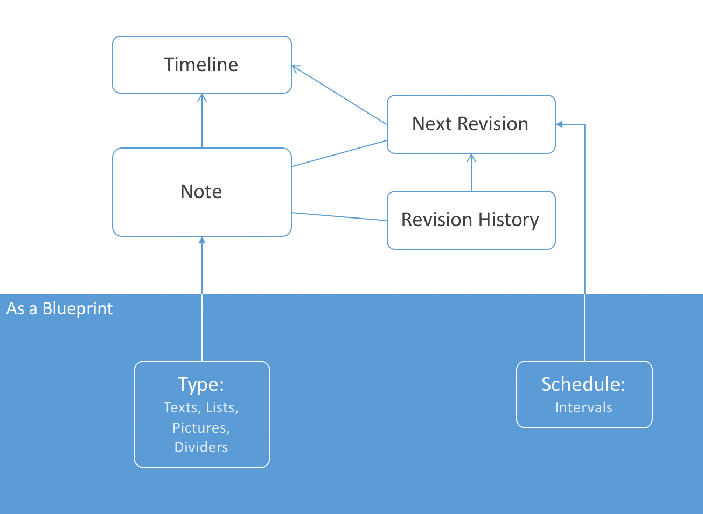
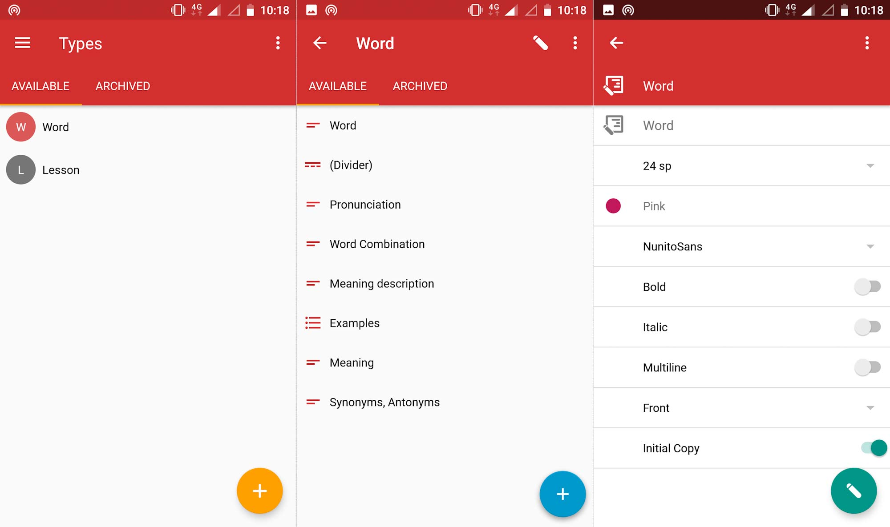
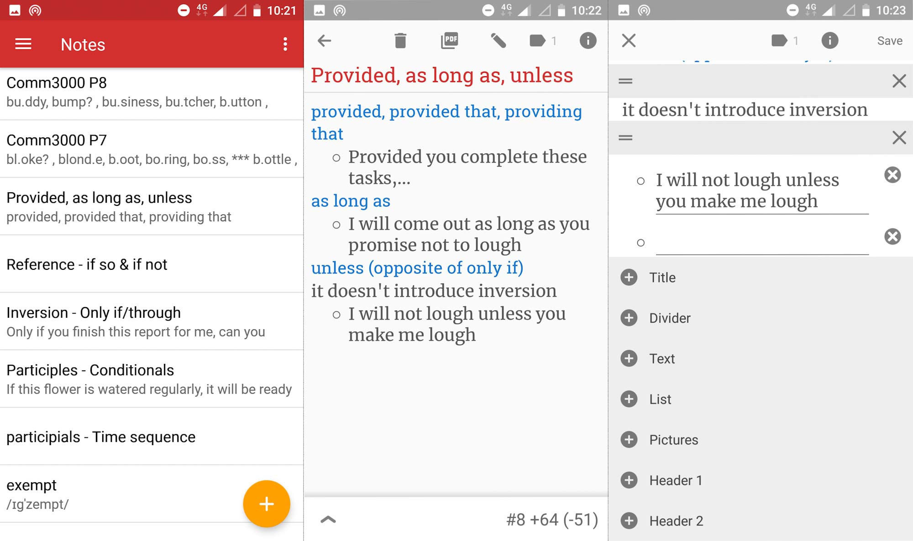
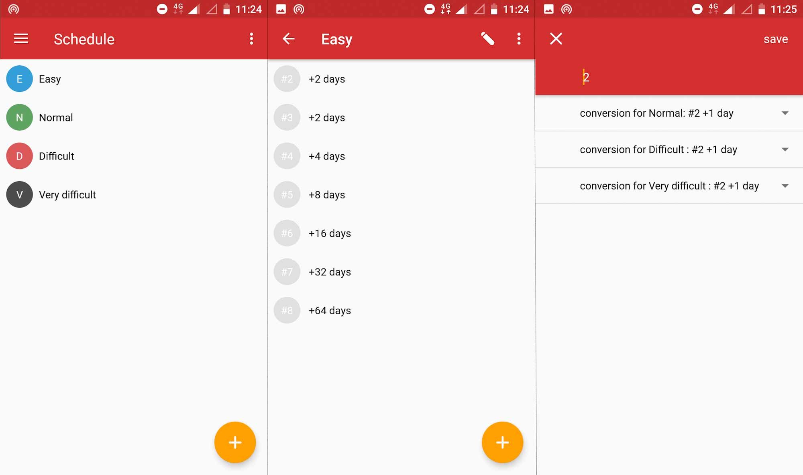
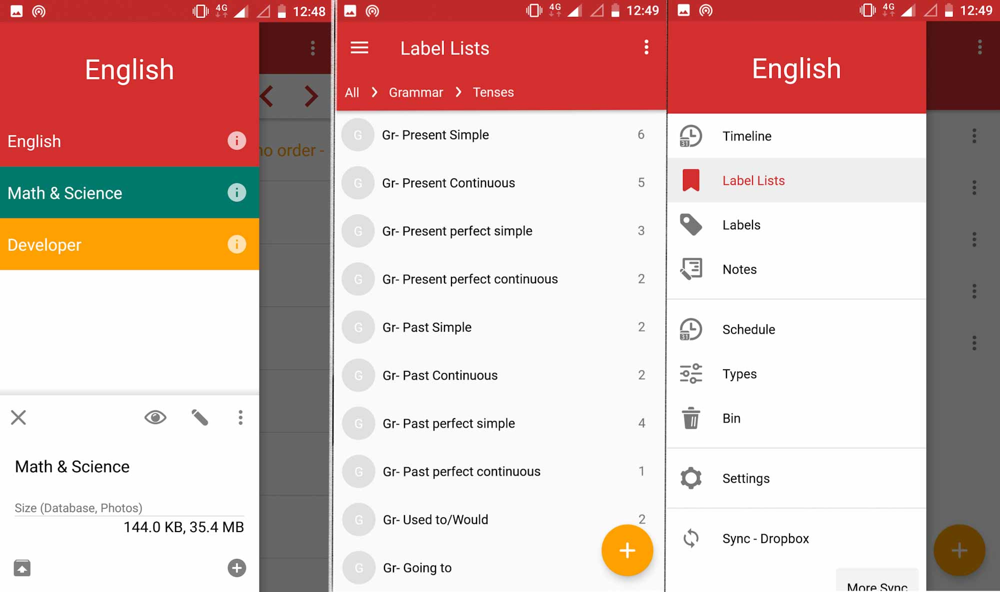

<h1>Elements of Spaced Notes</h>

# Main Elements

First, the user creates a template, which is called a "type", for notes indicating what elements notes can have. Next, the user creates one or more schedules, which typically should follow spaced repetition rules. After that, the application is set up and ready for note-taking. That is, whenever the user wants to memorize something using spaced repetition, she creates a note of those materials and assigns a schedule to it. The application will bring the note into the timeline, where is the place the user will revise the notes, whenever appropriate.

**Types:**

Users can define one or more "types". each type is like a blueprint from which notes can be created. Conversely, each note must be made from one and only one type. A Type indicates the kind of elements and the style of each element in the notes that are created from it. Currently, elements supported for types are texts, text lists, photos, and section dividers. A type might consist of any number of any of these elements.

**Notes:**

The materials that users wish to revise are written/inserted in notes. A note itself is made of a number of elements. each element in a note is created using one and only one element from the corresponding type. In other words, the elements of a type, act like blueprints for elements in the notes created from that type. For instance, if a type has two text elements and one photo element, a note made from that type can have any number of elements where each element in the note must be from one of the three elements of that type. A note also supports ordering/arranging of its elements.

**Schedules:**

The user defines one or more "schedules" to specify the way the notes should be revised. Each schedule includes a set of ordered numbers indicating the minimum number of days between revisions. The mechanism of the schedules is best explained by an example. Let us say we have a schedule with numbers 1, 2, 4, 8, 16, and 32 in that order. Once a note is assigned to that schedule, after 1 day of the assignment date, the note will show up for revision. Whenever the user marks the note as revised, the note will show up again after 2 days of that revision date. This means that if the user revises the note after 2 days instead of after 1 day, the note will show up again after 2+2=4 days of the initial assignment to the schedule and not 1+2=3 days. This cycle will repeat for all elements in the sequence of the schedule.

**Timeline:**

Timeline is the main page of the application where the user can see which notes need revision, when and which notes had been revised previously, when and which notes should be revised in the future. Timeline hosts one section for each day, hence three kinds of sections can appear. one section for the current day, sections for past days, and sections for future days. The section for current day presents all the notes that require revision, whether the revision was due days ago or is due the current day; it also shows the revisions finished in the current day. The sections for past days hold the history of previously done revisions and the sections for future days view the notes that should be revised in those days in the future.

# Profile, Label, and Label list

**Profile:**

Profiles enable the user to separate content for different topics. Each profile is completely separate from other profiles, meaning that there is no data sharing between profiles. A profile has its own notes, types, schedules, revisions, labels, and basically every other entity in the application. Even the physical database for each profile is separate. Profiles are ideal for separating study materials for unrelated topics, such as mathematics and English language.

**Label:**

Each note can associate with a number of labels. Using labels, it becomes possible to view notes with similar features by labeling them with a specific label. Labels are exactly as their names suggest; they label the notes so it is possible to find the note later using that label.

**Label List:**

Label lists are entities that include an ordered list of either labels or label lists. Label lists make it possible to create a tree-like hierarchy of labels. It can be used, for instance, to simulate sections and chapters of a book.

# Syncing

Syncing enables the user to use the application across multiple devices. It also stores the data safely in the cloud to prevent data loss. Since this application uses google drive or Dropbox to save data online, it is both free and provides a high level of data privacy. The structure of the user data is designed in a way (more explanation in program structure section) that by each time syncing, only the new changes are uploaded and hence syncing is both fast and requires minimum data transfer over the internet.

