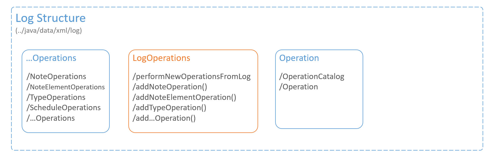

**Application Structure**
<p>The logical division of Spaced Notes components can be depicted as below:</p>


# Log Structure

the overall structure of the logging mechanism is depicted below:



**Operation**

Each action in the application that changes the underlying application data, is performed in the form of an Operation. the "Operation" class encapsulated such operations as it contains all the necessary information that an action needs to be performed. The Operation instance can then be used at any time to perform its underlying action.

**Operation Catalog**

Every operation that has ever been performed in the application is saved in a log file. The class "OperationCatalog" provides the means to add, delete, and query those operations. This class uses "lazy execution" meaning that a Log file will only be read if a query is being executed that requires information from that specific Log file.

**Log Operations**

This class is responsible for saving operations in log files as new operations are performed in the application as well as reading operations from the log files and executing them in the application. The method ```performOperationsFromLog()``` checks the OperationCatalog for unperformed operations and executes them. The methods that have the pattern ```add...Operation()``` are used to add operations to log files as new operations are executed in the application; these methods are called from their corresponding classes in the ```xml/log/operations``` folder.

**...Operations**

These classes reside in the ```xml/log/operations``` folder and their methods are called by the classes in Data Model to save operations in log files as those operations are executed in the application.
