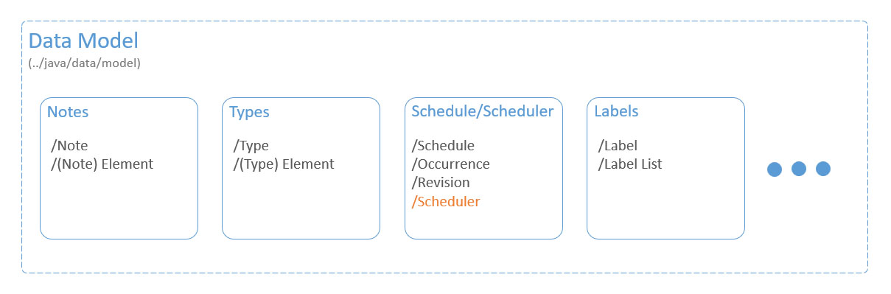

**Application Structure**

The logical division of Spaced Notes components can be depicted as below:

# Data Model

These components constitute the core functionality as well as the data representation of the application. The following are the main types of classes in this group:

- Object representation of application concepts, such as a note, schedule, type, and etc.
- Object catalogs containing the lists of objects, such as notes, as well as the functions that apply to them.
- Classes containing the logic for scheduling notes and note revision operations.

        

[Go to ../java/data/model](../app/src/main/java/data/model)

**Types**

Each type is like a list that contains zero or more type elements. There are four kind of type elements that a type can contain; namely text, list, picture, and divider. Each type element specifies the details of how that element appears. For example, a text type element specifies the color, font, size, and etc. of the underlying text and it also gives a name to that type element.

[Go to ../java/data/model/type](../app/src/main/java/data/model/type)

**Notes**

Each note is like a list that contains zero or more note elements in a specific order. Each note is linked to (sampled from) one specific type. The kinds of note elements that a note can contain is specified by the corresponding type. Each note element is linked to (sampled from) one and only one type element from the corresponding type for that note. For example, if a type contains a "type text element" named "title", then a note sampled from that type can have zero or more note elements that are sampled from "type text element".

[Go to ../java/data/model/note](../app/src/main/java/data/model/note)

**Schedule/Scheduler**

Each schedule defines a time pattern in which notes with that schedule should be revised. Each note can be assigned to a maximum of one schedule. Each schedule consist of an ordered list of occurrences. Each occurrence specifies the number of days that should pass after previous revision before a new revision can be made. Each revision specifies a specific date that the user has revised a note, this revision is called "RevisionPast". the earliest time that a new revision for a note can be made (that is calculated in "scheduler" using occurrences in the corresponding schedule) is saved as "RevisionFuture".
The Scheduler is a class that contains the logic for calculating revisions, converting between schedules, and other schedule related calculations.

[Go to ../java/data/model/schedule](../app/src/main/java/data/model/schedule)

[Go to ../java/data/model/scheduler](../app/src/main/java/data/model/scheduler)

**Label**

Each note can have one or more labels, each label can be assigned to one or more notes. Labels help the user to organize notes in a meaningful manner. Each "labelList" contains zero or more "labelList"s as well as zero or more labels. Each label can be assigned to multiple labelLists while each labelList can be assigned to only one other labelList. Labellists help user to group labels in a meaningful manner.

[Go to ../java/data/model/label](../app/src/main/java/data/model/label)

**Other Elements**

Data Model also contains other elements such as profiles, pictures, and existances. Each profile defines its own entire dataset as if the application was freshly installed. Each file (in filesystem) that is referenced in the databases, such as pictures, xml log files, and data capture files are represented as an "existance" in the data model.
