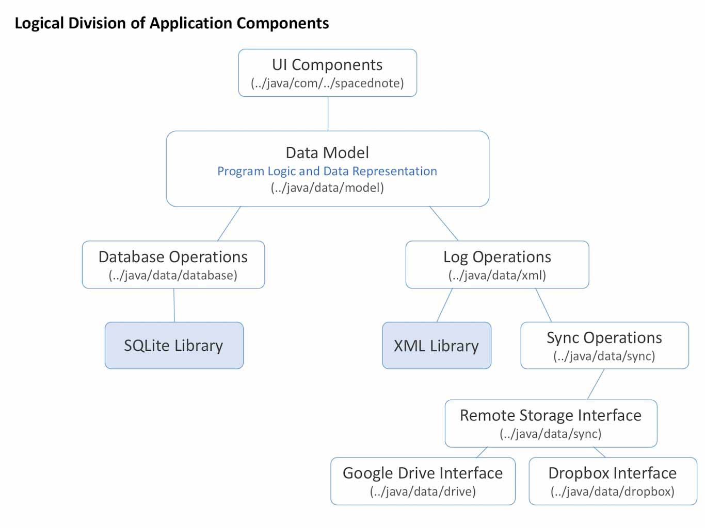
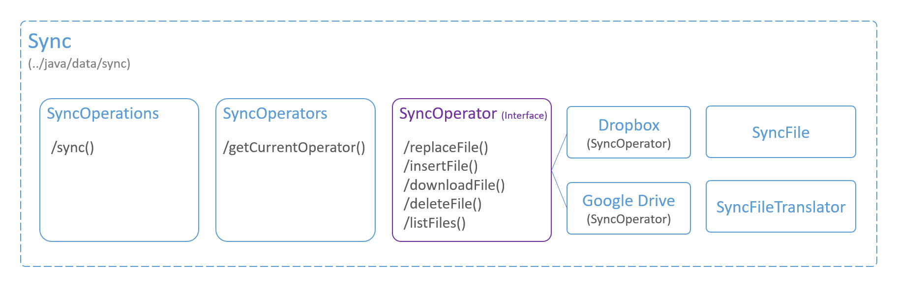

**Application Structure**
<p>The logical division of Spaced Notes components can be depicted as below:</p>



# Sync Structure

The method ```sync()``` in SyncOperations class is called on a worker thread (from a Service) to initiate the sync process. The overall structure of sync classes is depicted below:



[Go to ../java/data/sync](../app/src/main/java/data/sync)

**SyncOperations**

The class SyncOperations has only one public method ```sync()```, the overall structure of sync method is as follows:
 1. Retrieve Ports from Remote Server
 2. Compare retrieved ports with existing ports, if retrieved ports are newer, retrieve required log files from remote server.
 3. Examine the local and remote existences and upload, download, and delete remote existences (including pictures and captures) if required. 
 4. If existing ports are newer (including the changes after updating existences), upload existing ports along with required existing logs to the remote server.
 
 
**SyncOperator**

This is an interface with the necessary methods for modifying contents from  a remote storage. The class "SyncFile" is used as an abstraction to reference to a remote file in a remote storage. The class "SyncFileTranslator" is a helper class that creates "SyncFile" instances from existing files such as from ports, logs, pictures, and captures.
 
 
**SyncOperators**

This is a static class that points to the current "SyncOperator" which (as of writing) can be an instance of the Dropbox SyncOperator or Google Drive SyncOperator.
